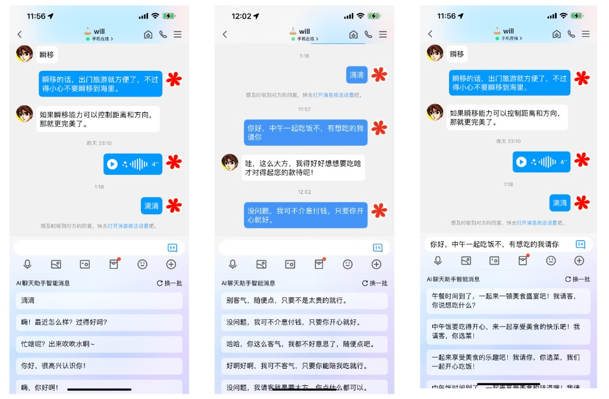

# 3. 产品 Agent 化：软件形态正在发生什么变化

> 从人类掌握电力到电力转化为巨大的生产力，与之配套的基础设施和人类的认知，经历了远比技术本身更漫长的适应周期。

---

前两节，我们分别从**宏观信息革命的历史坐标**与**产品经理的角色演进**两个维度，探讨了生成式 AI 所引发的结构性变革。如果将视线进一步拉近，聚焦到具体的产品形态本身——这场深刻的生产方式变革，究竟在产品层面催生出了怎样的新范式？AI 时代的互联网产品，正在经历一次怎样的跃迁？

本节将尝试回答这个问题。需要说明的是：我们仍然处于 AI 产品发展的早期阶段，任何试图总结「终局形态」的论断都过于武断。以下所呈现的，是对当下这一历史节点的阶段性观察与思考框架，而非最终答案。

---

## 一、从业务实践出发：AI+ 与 +AI 的两条路径

### 两个方向的起点

2022 年底，我负责 QQ 的 AI 业务，这个命题第一次真实地摆在我面前。我翻遍了市面上所有的 AI 产品，彼时的 LLM 应用还主要以对话（Chat）与 AIGC 内容生成为主，大致形成了两个相对热门的赛道。

其一是**效率工具导向**，以 Notion AI、ChatPDF、X 平台的自动生成推文工具、Jasper.ai 等为代表；其二是 **AI 虚拟社交**，以 Character.ai（Transformer 作者之一创办，团队后被 Google 收购）、Glow（MiniMax 早期产品，后因特殊原因关闭）、小侃星球（百度虚拟偶像产品，叶悠悠和林开开）、Replika（带有角色形象的人物克隆）等为代表。

综合调研结论与实际业务需求，我们最终确认了两个核心方向——**AI+QQ** 与 **QQ+AI**。

**第一个方向：AI+QQ（AI Native 方向）。**

这是一条完全 AI Native 的路径。我们希望通过引入 AI 角色、形象与能力，帮助 QQ 用户建立一个全新的社交关系网络，绕开熟人社交与微信的正面竞争。具体来说，我们希望通过 AI 创建三类核心数字人形态——**情感陪伴**、**游戏互动**、**助手工具**：口语外教（助手工具）帮你通过语音练习英语口语，码云（助手工具）帮你完成编程作业，心情树洞（情感陪伴）供你倾诉情绪，成语接龙（游戏互动）和你来回过招，以及沈思前这样的 IP 形象（情感陪伴）陪你日常聊天。为了快速上线并评测这些数字人，我们专门搭建了 Agent 平台——**女娲**（QQ 自己训练的第一个模型叫 lucy，与女娲的命名也算一个呼应）。

**第二个方向：QQ+AI（Copilot 方向）。**

这是一条在原有场景内用 AI 提效的路径，目标是提升转化与留存。我们将 QQ 内所有场景按重要性与流量规模做了优先级排序。其中最重要的是**小 Q 助手**——可以跨场景帮用户完成各种 QQ 内的任务（QQ 也是国内主流 IM 工具中第一个支持流式输出的产品）。

举其中另一个重要场景为例：**对话**。对话表达有三道真实的门槛：不知道怎么破冰，不知道怎么接话，不知道自己这样说是否得当。借助用户的历史对话风格与期望的表达形式，我们设计了 **AI 聊天助手**（如图为早期版本），帮助用户在具体对话场景中更顺畅地表达与沟通。



以上是一个真实业务在 AI 时代的思考切面。可以看到，其中一部分是**全新的 AI 场景**——这便是 **AI+**：AI 作为服务的核心，原有产品只是提供流量与入口；另一部分则是**原有场景的 AI 增强**——这便是 **+AI**：原有服务依然是核心，AI 是其中的效率增强工具。

**表 1：AI+（AI Native）与 +AI（AI Copilot）战略路径对比**

| 维度 | AI+（AI 作为核心） | +AI（AI 作为工具） |
|---|---|---|
| **战略定位** | AI 是服务的核心驱动力，原有产品提供流量与入口 | 原有业务依然是核心，AI 是其中的效率与体验增强层 |
| **典型形态** | AI 角色/数字人、情感陪伴、智能助手 | 场景内 Copilot、智能搜推、对话辅助 |
| **QQ 实践案例** | 数字人平台「女娲」：口语外教、编程助手、心情树洞、沈思前等 AI 形象陪伴，探索全新社交关系网络 | QQ Copilot / 小 Q 助手：跨场景任务执行；AI 聊天助手：根据用户风格辅助对话破冰、接话与表达 |
| **核心挑战** | 冷启动难，用户对 AI 关系认知门槛高，留存依赖情感连接深度 | AI 价值感知需嵌入高频场景，改造既有产品架构的工程成本高 |
| **竞争护城河** | AI 角色的个性化记忆与情感深度 | 业务场景理解深度 + 数据积累 |

### 从局部实验到行业主流

这两个方向的探索，是一家业务公司在 AI 时代早期最真实的思考切面：*试图用 AI 这把新锤子，去解决旧产品的旧钉子问题*。

随着时间推移，来到 2026 年的今天，AI Native 的产品形态已逐渐成为行业主流。这与电力技术的普及历程高度相似——从技术突破到生产力的大规模释放，中间隔着基础设施、认知范式和组织结构的整体迁移，而这一过程往往比技术本身的演进更为漫长。


**核心观点**

AI 时代的产品命题，不是「要不要做 AI」，而是**如何找到 AI 能力与业务价值之间的最优耦合点**。

AI+ 与 +AI 并非对立，而是在产品不同阶段、不同场景下，各有其适用的生命周期与战略逻辑。

真正的陷阱，是将 AI 视为万能钥匙，而非将其视为一种**需要被精心匹配的能力资源**。


---

## 二、AI Agent 产品的三种形态

跳出 QQ 这一具体业务的视角，将视野拓宽至整个行业，可以观察到：当下所有 AI Agent 产品，本质上都可以归为**三种相互递进的产品形态**。这是一个历史阶段性的归纳——它反映当下，而非终局。

这三种形态，分别承担着不同的产品逻辑与价值定位：

- **范式一：LUI 分发产品**——以自然语言为新的分发管道，分发的依然是**原有的服务供给**；
- **范式二：Copilot 内容生成与操作执行**——在原有业务场景中，用 AI 实时**生成内容**或**执行操作**，替代既有的规则体系；
- **范式三：AI Native 产品**——人类不再是生产的主角，**AI 主导生产**，人类只出现在意图发起与结果验收的两端。

为便于读者快速建立整体框架，本节先以一张总览表呈现三种范式的核心差异，随后再分章详细展开每一种范式的产品逻辑与设计要点。

**表 2：AI 产品三种范式的核心特征对比**

| 维度 | 范式一：LUI 分发 | 范式二：Copilot 生成与执行 | 范式三：AI Native |
|---|---|---|---|
| **核心交互** | 自然语言对话 / 消息流 | 场景内嵌入式生成与执行 | 持续监听 + 主动执行 |
| **服务逻辑** | 被动响应用户输入 | 被动增强现有服务质量 | 主动预判并提前执行 |
| **分发对象** | 仍是原有的服务供给 | 在原有场景中加载 AI 能力 | AI 直接生产，无需中间供给方 |
| **内容形式** | 文本 / 多模态消息 | 生成内容 / 操作动作嵌入既有界面 | 代码、指令，操控硬件与系统 |
| **在线状态** | 会话期内在线 | 场景使用时在线 | 7×24 小时持续在线 |
| **生产主角** | 人类（既有服务供给方） | 人类为主，AI 为辅 | **AI 主导生产，人类只出现在末端** |
| **典型产品** | ChatGPT、Perplexity、小 Q 助手 | Keep AI 陪跑、Notion AI、GitHub Copilot、Midjourney | Codex、Manus、Cursor Agent、未来的个人 OS |
| **AI 角色** | 信息分发与任务调度中枢 | 内容生产 + 操作执行的辅助层 | 自主行动的智能体 |
| **当前成熟度** | 商业模式初步验证 | 相对成熟，广泛落地 | 早期探索，局部可用 |

---

## 三、范式一：LUI 分发产品

LUI 分发是当下 AI Agent 产品中落地最广、共识最多的一类形态。它的本质，是**用自然语言这一新介质，重构信息与服务的分发方式**——而非仅仅「做了一个聊天窗口」。本章将从交互范式的演进出发，逐步阐明 LUI 分发产品的本质、价值边界与服务架构。

### GUI 到 LUI：交互介质的根本转变

要理解当下 AI 产品形态的变化，必须先理解人机交互方式的底层逻辑。

Windows 时代的伟大发明之一，是鼠标与 GUI（图形用户界面）。GUI 将人机交互带入了全新的高度——用户通过点选、拖拽、双击等操作，以**视觉空间**为隐喻，触发计算机完成各类任务。此后数十年，产品设计的核心命题，始终是**如何在有限尺寸的屏幕上，构建出高效流动、易于操作的信息界面**。

进入 AI 时代，这一范式正在被根本性地替换。人机交互的核心介质，从 GUI 转向了 **LUI（Language User Interface，语言用户界面）**。

**图 1：GUI 到 LUI 的交互范式迁移**

| 维度 | GUI 时代 | →（范式迁移）→ | LUI 时代 |
|---|---|---|---|
| **外设** | 鼠标、键盘、触控 | | 自然语言（含语音） |
| **操作语言** | 点击、滑动、双击 | | 语义意图表达 |
| **产品核心** | 信息架构 + 交互流 | | 意图理解 + 服务编排 |
| **分发方式** | 推荐算法 + 手势滑动 | | 生成算法 + 语言输入 |
| **用户记忆** | 界面路径的肌肉记忆 | | 意图表达的语言习惯 |
| **内容生产** | 规则体系 + 供给匹配 | | 服务结果 + 语言包装 |

> *结构角色类比：* 推荐算法之于 GUI 的角色，类似生成算法之于 LUI；手势操作之于 GUI，类似语言输入之于 LUI——**这是结构角色的映射，而非技术上的等价**。

### LUI 的本质：不是对话，而是新的分发管道

理解 LUI 的关键，在于**不要将其窄化为「聊天窗口」或「对话机器人」**。这是一种常见却危险的认知误区。

LUI 的本质，是*人类未来获取信息与服务的新通道*：以自然语言作为原始输入协议，以生成内容作为输出协议，以消息流替代过去的信息流。

从**结构角色**的视角来看，可以做一个有益的类比映射：

| GUI 时代 | ↔ 结构角色类比 ↔ | LUI 时代 |
|---|---|---|
| 推荐算法 | | 生成算法 |
| 滑动操作 | | 语言输入 |
| 短视频信息流 | | LUI 消息流 |

需要特别说明的是，这一类比描述的是**结构角色**的相似性，而非**分发对象**的等价。两者存在根本差异：*推荐算法分发的是已有的存量内容*——视频、商品、文章等由平台预先生产的供给，用户在结果中被动消费；而 *LUI 中的生成算法，分发的本质是「服务」而非「内容」*——通过理解用户意图，对底层既有的搜索、电商、日历、第三方 API 等传统服务做编排与组织调度，所谓的「生成内容」，本质上只是对服务执行结果的**语言化包装**，而非凭空创造的新供给。

换句话说，今天市面上绝大多数 chatbot 类产品，其真正的产品命题并不是「让 AI 写出更好的文字」，而是：**用自然语言这个新的统一入口，对原本散落在各处的服务做意图理解、编排与重新分发**——这才是 LUI 之所以是**分发管道**的真正含义。

在 LUI 时代，传统的服务供给体系将演变为下游的工具层（Tools/Skills/Sub-agents），以**被动式 Agent** 的形式接受调度。然而，这一范式同时带来了一个无法回避的核心挑战：

> **LUI 的分发效率，真的优于既有的搜推体系吗？**
>
> 除知识问答场景外，LUI 无法凭空创造业务供给——它的分发效率，仍然依赖于现有供给的质量与丰富度。这正是大量企业做了 Chatbot 却未能获得实质业务收益的根本原因。

### LUI 的场景价值判断

并非所有业务场景都适合以 LUI 作为主路径。要做出理性的场景判断，需要沿**任务复杂度**与**业务模块跨度**两个维度，对业务场景进行系统性分类。

**表 3：LUI 适用性分析——业务场景分类矩阵**

| 场景类型 | 典型特征 | GUI 的局限性 | LUI 价值评估 |
|---|---|---|---|
| **单业务单步** | 单一页面内的单次操作，路径清晰，用户已有肌肉记忆 | 基本无局限，效率已高度优化 | 价值有限 |
| **单业务多步** | 同一业务场景内的多步骤组合操作，涉及个性化约束 | 无跨步骤上下文记忆；无法处理自然语言表达的复合约束；无法直接操作最终结果 | **高价值场景** |
| **多业务多步** | 跨越多个业务模块的联合任务，需要跨维度推理 | 各模块相互独立，无法跨场景联合推理；依赖用户手动串联多个入口 | **最高价值场景** |
| **探索性/开放性需求** | 用户本身尚不清楚自己想要什么，需要在交互中逐步收敛目标 | GUI 依赖用户提前知道自己要点什么入口；开放性意图在固定导航结构中无处着落 | **独特高价值场景** |


**核心观点**

如果你的核心业务场景中，**多步操作、跨模块推理、探索性开放意图**三类需求占比均不高，强行将 Chatbot 设置为主路径，将造成明显的使用摩擦，反而拉低整体产品效率。

LUI 入口，应在 GUI 触达不到的场景中**自然生长**，而非作为流量漏斗的顶层被强制推广。

判断 LUI 价值的核心标准，始终是：**它是否真正解决了 GUI 难以解决的问题？**


**图 2：LUI 分发适用性判断框架**

```
                      ┌──────────────────────────┐
                      │  业务是否存在大量多步操作？  │
                      └────┬─────────────────┬───┘
                       否 │                 │ 是
              ┌───────────▼────┐    ┌────────▼─────────────┐
              │ 是否存在探索性    │    │ 是否存在跨模块联合    │
              │ 开放意图需求？    │    │ 推理需求？             │
              └─┬───────────┬──┘    └────┬──────────────┬──┘
              否│         是│         否 │            是 │
       ┌────────▼─┐  ┌──────▼────────┐  ┌─▼──────────┐  ┌─▼──────────────┐
       │ 不建议以  │  │ LUI 探索场景   │  │ LUI 高价值  │  │ LUI 最高价值    │
       │ LUI 作    │  │ 价值：开放意图 │  │ 场景：单业务 │  │ 场景：跨业务     │
       │ 主路径    │  │ 收敛入口      │  │ 多步 Copilot│  │ Agent 入口      │
       │（保持 GUI │  │              │  │            │  │                │
       │ 高效路径）│  │              │  │            │  │                │
       └──────────┘  └──────────────┘  └────────────┘  └────────────────┘
```

> 在多步操作与跨模块推理之外，**探索性/开放意图场景**是 LUI 的第三类独特价值场景。

### LUI 产品的服务分发架构

在明确了 LUI 的本质与价值场景之后，我们可以进一步将 LUI 分发产品的内部结构抽象为一个清晰的分层架构：最上层是用户的自然语言意图输入，中间是负责意图理解、任务规划与上下文管理的 **LUI 核心层**，再往下则是服务调度层（Tool Calling / Function Calling），传统的服务供给体系——搜索、电商、日历、第三方 API 等等——均在其下沉为下游的工具层（Tools / Skills / Sub-agents），以**被动式 Agent** 的形式接受调度。

> 不要把 LUI 产品理解为「做了一个聊天窗口」。
>
> 真正的命题是：**人类将通过消息流获取所有信息与服务，通过自然语言完成所有交互**——这是分发逻辑的底层替换，其影响深度不亚于搜索引擎的出现。

**图 3：LUI 产品的服务分发架构**

```
        ┌────────────────────────────────────────────────┐
        │      用户意图输入（自然语言）                      │
        └───────────────────────┬────────────────────────┘
                                │
        ┌───────────────────────▼────────────────────────┐
        │   LUI 核心层：意图理解 · 任务规划 · 上下文管理       │
        └───────────────────────┬────────────────────────┘
                                │
        ┌───────────────────────▼────────────────────────┐
        │   服务调度层：Tool Calling / Function Calling    │
        └─┬────────┬─────────┬──────────┬──────────┬─────┘
          │        │         │          │          │
       ┌──▼──┐ ┌──▼──┐  ┌────▼───┐  ┌───▼────┐ ┌───▼─────┐
       │搜索  │ │电商  │  │ 日历    │  │ 内容    │ │第三方    │
       │服务  │ │购物  │  │ 任务    │  │ 生成    │ │ API     │
       └─────┘ └─────┘  └────────┘  └────────┘ └─────────┘
                       ↓ 下游 Skills / Tools ↓
```

> 意图理解层居中调度，传统服务供给降级为可组合的下游工具层。

---

## 四、范式二：Copilot 内容生成与操作执行

Copilot 模式的本质，是**在原有的业务场景中，用 AI 实时生成内容、或代用户执行操作**——通过这两种能力替代过去基于规则的体系，将服务的个性化深度和场景渗透度同步拓宽。

具体来说，Copilot 包含两种相互支撑的能力形式：

| Copilot 能力类型 | 典型场景 | 替代的原有逻辑 |
|---|---|---|
| **内容生成（AIGC）** | Keep AI 陪跑教练实时生成语音指导；Notion AI 生成文档草稿；QQ AI 聊天助手生成回复候选；数据报表的 AI 摘要解读；简历筛选的 AI 评分意见 | 固定模板 / 预设规则 / 人工阅读总结 |
| **操作执行** | GitHub Copilot 代码补全并自动应用；邮件自动起草并归类；浏览器中 AI 自动填表与表单提交；办公软件中 AI 直接修改文档内容 | 重复性手工操作 / 固定脚本调用 |

需要说明的是，无论是**分析辅助**（帮你读懂数据）还是**决策辅助**（帮你权衡选项），其本质仍然是*生成解读内容、生成决策建议*——这些都属于内容生成（AIGC）的延展，并非独立的 Copilot 能力类型。Copilot 模式真正的二元结构，是**生成内容**与**执行操作**。

以 Keep App 为例：当用户进行跑步训练时，AI 陪跑教练能够基于实时运动数据生成个性化语音指导；当用户打开一节课程时，AI 教练可根据用户的身体状态和历史训练数据，对动作要领和课程难度进行实时微调。

这一模式与业务场景高度耦合，是 AI 能力为传统业务赋能最直接、落地收益最可感知的路径。其价值不在于颠覆原有产品逻辑，而在于**用 AI 生成与执行能力替换规则体系，从根本上解锁个性化服务的深度上限**。

**表 4：Copilot 模式的典型场景与核心价值矩阵**

| 行业 | 典型产品 | AI 替换的规则体系 | 核心价值增量 |
|---|---|---|---|
| 健身运动 | Keep AI 陪跑教练 | 固定语音包 / 预设课程结构 | 实时个性化指导，提升训练效果与留存 |
| 代码开发 | GitHub Copilot | 代码模板 / 文档搜索 | 上下文感知的代码补全，提升开发效率 |
| 文档写作 | Notion AI | 模板匹配 / 格式规则 | 基于语义的内容生成与结构优化 |
| 即时通讯 | QQ AI 聊天助手 | 表情包推荐 / 话题引导 | 基于用户风格的个性化表达辅助 |
| 内容平台 | 智能摘要 / 个性化推送 | 关键词标签 / 规则过滤 | 深度语义理解，提升内容匹配精度 |

Copilot 模式与既有业务的结合，本质上是一次**产品能力密度的提升**，而非产品形态的颠覆。它也因此成为当下 AI 落地最广泛的范式——改造成本相对可控，用户心智迁移成本低，业务收益可快速量化。

---

## 五、范式三：AI Native 产品

在正式讨论 AI Native 的形态之前，有一个认知前提值得单独强调：

> **代码，不是一种技术，而是人类与机器对话的语言协议。**
>
> 理解了这一点，才能理解 AI Native 产品两大核心特征的真正含义。

AI Native 的根本判别标准，可以归结为一句话：**在生产链路中，人类不再是生产的主角，AI 才是**。人类只出现在链路的末端——发起意图、验收结果——中间所有的生产、执行、决策由 AI 主导。这一标准在产品形态上，对应两个不可分割的结构特征：

**图 4：AI Native 产品的两大核心特征**

```
   ┌─────────────────────────┐  ┌─────────────────────────┐
   │   7×24h 主动服务         │  │   输出主体为代码         │
   │                         │  │                         │
   │   模型永远在线            │  │   通过机器语言（代码）     │
   │   持续监听与思考          │  │   操作物联网设备         │
   │   不再依赖人类输入触发     │+ │   与各类硬件             │
   │   靠自己的理解            │  │                         │
   │   提前预知并主动满足      │  │   不再只是人类电脑、       │
   │   人类需求               │  │   手机里的玩具           │
   └────────────┬────────────┘  └────────────┬────────────┘
                │                            │
                └──────────────┬─────────────┘
                               ▼
        ┌─────────────────────────────────────────┐
        │  ⇒ AI 主导生产，人类仅出现在末端          │
        │     ——真正的 AI Native                  │
        └─────────────────────────────────────────┘
```

**7×24h 在线**意味着模型始终处于监听与推理状态，不眠不休；**主动服务**意味着模型不再被动等待人类输入指令，而是基于对用户状态的持续理解，提前预知并满足需求；**输出主体为代码**意味着模型通过机器语言，直接操控物联网设备、智能硬件与各类数字基础设施——不再只是停留在屏幕上供人类阅读的文字内容。

把这三点放在一起，可以看出 AI Native 与前两种范式的根本差异：

| 维度 | LUI 分发 | Copilot 增强 | AI Native |
|---|---|---|---|
| **生产主角** | 人类（仍是供给生产者） | 人类（AI 为辅助） | **AI（人类只出现在末端）** |
| **触发模式** | 用户主动发起 | 用户在场景中触发 | **AI 主动预判** |
| **输出形态** | 自然语言响应 | 内容生成 / 操作执行 | **代码 ⇒ 操控硬件设备** |

不满足上述两大特征的产品，本质上仍是前两种范式的变形——即便它们也由大模型驱动。换句话说，今天的大多数所谓「AI 产品」，都尚未真正进入 AI Native 的边界。

---

## 六、三种范式的演进关系

### 不是替代，而是递进

理解这三种范式的关键，在于认识到它们并非相互替代的竞争关系，而是**技术成熟度与产品形态递进**的三个发展阶段。

**图 5：三种 AI 产品范式的演进关系**

```
   AI 作为入口         AI 作为工具          AI 作为主体

   ┌─────────┐  能力   ┌─────────┐  形态   ┌─────────┐
   │  LUI    │  深化   │ Copilot │  跃迁   │   AI    │
   │  分发    │ ──────▶│  生成    │ ──────▶│ Native  │
   │         │         │         │         │         │
   │被动响应   │         │场景嵌入  │         │主动服务  │
   │语言交互   │         │生成替代  │         │代码操控  │
   │入口      │         │规则      │         │世界      │
   └─────────┘         └─────────┘         └─────────┘
   当前主流落地形态     场景增强首选路径      终极形态的雏形
   商业模式初步跑通     对既有产品改造最小    仍处于早期探索期
```

> 从 LUI 分发入口，到 Copilot 场景增强，再到 AI Native 主动行动，AI 在产品中的角色持续深化。

### 当前的阶段性判断

以今天（2026 年）的技术与市场格局来看，三种范式的发展状态可以概括如下：

| 范式 | 当前状态 | 主要制约因素 |
|---|---|---|
| **LUI 分发** | 商业模式初步跑通（ChatGPT、Perplexity 等），但分发效率与信息密度相较搜推体系仍存在差距；「为何要来和 AI 聊天」的用户动机教育成本高 | 分发效率、供给质量 |
| **Copilot 生成** | 落地案例最为丰富，业务改造成本可控；在代码（GitHub Copilot）、文档（Notion AI）、搜推（各平台 AIGC 模块）等场景均有成熟实践 | 场景识别准确率、生成内容质量 |
| **AI Native** | 以 Codex、Manus、Cursor Agent 等为代表的早期产品已初步验证可行性；但大规模生产级可靠性仍待突破，完全的自主行动能力尚未成熟 | 推理可靠性、长链路执行稳定性 |


**核心观点**

我们仍处于 AI 产品形态演进的早期。

历史告诉我们：从电力的发明到电力真正重塑生产方式，中间经历了数十年基础设施与认知范式的协同演进。

AI 的轨迹或许相似——**技术突破只是起点，真正的变革将在产品范式、组织结构与用户认知的共同迁移中完成**。

产品经理的任务，是在这场迁移中找到当下最值得押注的那个点。


---


**思考题**

亲身体验 [Multica](https://multica.ai/)（`https://multica.ai/`）：

**当产品形态发生根本变革，AI 时代的组织分工将如何演化？**


---

*下一节 · 第零章第四节*

**AI PM 的能力模型：一个有战斗力的 AI PM 长什么样**

理解了产品形态的根本变革，下一步要回答的问题是：在这个新的产品范式下，**什么样的产品经理才真正具备战斗力？**
