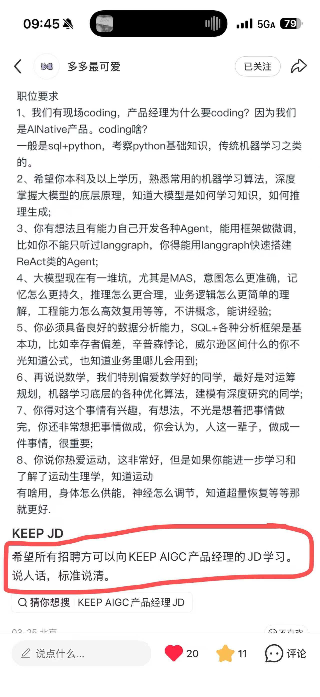

# 新连载：产品经理AI 手册

## 为什么要写这个系列

2022年底，我在腾讯开始做大模型相关的业务，截至今日，4年多时间，行业沧海桑田，人才涌入，卷到飞起。但是在招聘中，我们却很难找到合适的人才，我们深刻感受到，市场的缺口是因为缺少know how造成的。行业对产品经理的全栈要求已经越来越高，AI能力已经是基础，不再是加分项。（招聘jd见文末）。

市面上关于 AI 的内容，**要么太浅——全是"教你用 ChatGPT"的使用技巧；要么太深——直接上论文和代码，普通 PM 根本跟不上。**

夹在中间的产品经理，其实最需要的是：**能看懂技术、能做决策、能和工程师对话、能把产品做出来** 的系统性知识。所以我决定把自己的经验整理成一个系列，叫做——

**《AI 产品经理手册》**
除了公众号，会同步更新到： https://book.likun.ai/ 

---

## 这个系列会写什么

整个手册分为九章，从"AI PM 是什么"出发，一路写到商业化落地。

**第零章　AI PM 的新起点**
这次技术变革和以往有什么本质不同；模型即产品意味着什么；AI PM 的能力模型和工具箱。

> 📌 **本章作业**：选 3 个大模型产品，用同一个复杂任务测试，记录各自的表现差异和你的判断。

**第一章　先学会衡量：评测体系的建立：评测即需求，评测即产品。**
为什么评测是 AI PM 的核心能力；如何构建评测集；Rubric 设计；LLM Judge 的正确姿势；怎么读各家模型发布评测结果里的水分。

> 📌 **本章作业**：为你负责的一个 AI 功能设计一套评测集（至少 30 个 case，覆盖正常、边界、对抗三类），并为其中一个核心维度写一份完整的 Rubric，定义 1～5 分各级别的判断标准。

**第二章　大模型是如何学习和理解业务的**
训练流程、对齐算法演进、算力与硬件、训练数据、微调框架……还有一个完整的真实案例：以 Keep 运动健康大模型为背景，从立项到上线每一个真实决策。

> 📌 **本章作业**：用 LoRA+ 对一个开源小模型做一次最简单的 SFT（自己的电脑就可以完成），准备 10～20 条业务相关指令数据，对比微调前后输出变化，写出你的观察。

**第三章　大模型是怎么工作的**
7 行代码调通 API；Token 生成的本质；采样参数怎么配；Prompt Engineering 实战；幻觉、延迟、成本的三角权衡。

> 📌 **本章作业**：默写并运行 7 行代码调通大模型 API；用同一 prompt 测试 temperature=0.1 / 0.7 / 1.5，记录输出差异，写出你的采样参数直觉。

**第四章　安全与治理**
内容安全红线、数据合规、国内备案实操——这些做产品绕不开的事。

> 📌 **本章作业**：设计一份内容安全红线清单（至少 10 条），并为其中 3 条各写一个对抗性 prompt，测试你选用模型的实际防御效果。

**第五章　Agent 全景**
从 ReAct 到 MAS；Agent 的认知能力、工具扩展、编排与 runtime；LangGraph、Dify、Coze 的选型，openclaw类产品的优劣对比。

> 📌 **本章作业**：用 Dify 或 Coze 搭建一个接入 2 个工具的 Agent，记录意图识别的失败案例，并设计一套记忆方案。

**第六章　动手做 Agent：工业落地的真实过程**
一个完整的 Agent 从需求拆解到上线的全流程实战记录，包括常见翻车点复盘。

> 📌 **本章作业**：用 LangGraph 实现一个最小可运行的饮食记录 Agent，跑通"记录一餐 → 查询今日摄入 → 给出建议"完整流程，写出遇到的问题和解法。

**第七章　AIGC 内容生成**
图像、视频、脚本的工业化生产；多模态内容流水线；版权与合规的现实处理。

> 📌 **本章作业**：选一个真实业务场景，用图像生成工具完成批量内容生产，提交 prompt 迭代记录（至少 3 轮）和 pipeline 设计思路。

**第八章　大模型时代的商业化**
Token 付费的本质；AI 产品成本结构拆解；ROI 怎么算；成本控制策略；定价模型设计。

> 📌 **本章作业**：估算一个 AI 功能的月度推理成本，并设计一套降本 30% 的方案，说明每项措施的预期效果与实施代价。

每章都有一道**实战作业**，不是选择题，是真正能动手做的任务，我也会同步公布答案。

---

## 更新计划

我会按章节顺序更新，频率大约是**每 1～2 周一篇**，尽量保证每篇质量，不水文章。

如果你想跟着这个系列系统学习，建议先关注本公众号，后续每章更新都会第一时间推送。

---

## 最后说一句

这个系列不是教程，也不是综述文章。
它是我踩坑之后，觉得"当初要是有人告诉我这些就好了"的那种内容。
有些结论可能不讨喜，有些观点可能有争议——但我会尽量写真实的判断，而不是正确的废话。
限于个人认知边界，有一些可能也会有问题，请多指正。

---

*关注公众号，不错过每一篇更新。*

